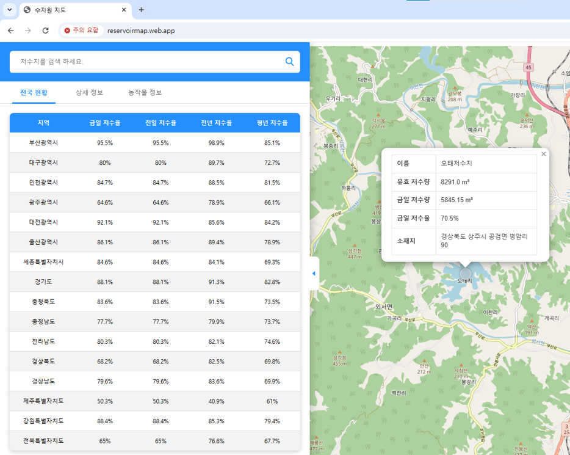

< 저수율 예측 가뭄 대비 작물 추천 사이트 프로젝트 >

1. 기능 소개

- 저수지 정보 검색 기능
    * 농촌 용수 종합 정보 시스템에 등록된 3438개의 저수지 중 1078개 저수지 정보 검색(구현율 : 32%)
    

- 저수지 정보 제공 및 추천 작물
    * 상세 정보 페이지와 팝업으로 저수지 정보 제공
    * 지도 위 마커로 위치 정보 제공
    * 저수지의 저수율을 예측한 데이터를 기반으로 알맞은 작물 추천
    

- 저수지 저수율 정보 제공
    * 상세 정보 페이지에 그래프로 저수지의 과거 저수율과 미래 예측 저수율 정보 제공
    * 
    * 파란색 (과거 저수율 데이터), 주황색 (미래 저수율 데이터)
    

- 농작물 정보
    * 
    

- 전국 저수율 현황
    

